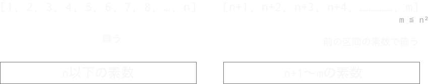

```{r setup, include=FALSE}
options(htmltools.dir.version = FALSE)
library(dplyr)
library(tidyr)
library(ggplot2)
library(ggdark)
library(gghighlight)
library(gt)
theme_set(dark_theme_classic(base_family = "IPAexGothic"))
```

```{r xaringan-themer, include=FALSE}
library(xaringanthemer)
mono_dark(
  text_font_family = "Noto Sans JP",
  text_font_size = "28px",
  text_font_url = "https://fonts.googleapis.com/css?family=Noto+Sans+JP",
  code_font_size = "24px", 
  code_font_family = "Fira Code",
  code_font_url    = "https://cdn.rawgit.com/tonsky/FiraCode/1.204/distr/fira_code.css"
)
```

class: middle, center

### 素数を数えたくなるとき、ありますよね？

---

class: middle, center

### そんな時どうするか……


---

class: middle

### 落ち着いて素数とは何だったか思い出しましょう

素数とは次のような性質をもった数のことです。

.center[]

- 1と自分の数でしか割ることのできない孤独な数字    
- わたしに勇気を与えてくれる

---

### 素数か、合成数か

- 素数でない数を**合成数**と呼びます。
- 素数の定義から、合成数は**1と自分自身以外の正の約数**を持つことがわかります。
- つまり、nが素数かどうか調べたかったら、1と自分自身以外の数で試し割りをして、割り切れる数字があれば合成数、なければ素数です。
- 実際には、試し割りは $\sqrt{n}$ までの数でOKです（もっと言えば素数でOKです）。
  - つまり合成数は $\sqrt{n}$ 以下の約数を必ず含むということです。念の為簡単に証明しておきましょう。
      - $n$ が合成数なら、 $n = a \times b$ と表せます。 ( $a, b$は1より大きい自然数）
      - $b \geq a$ とすれば、 $n = a \times b \geq a \times a$、したがって $\sqrt{n} \geq a$ （証明終）


---

class: middle, center

## 素数を列挙する（ナイーブな方法）

---

### 試し割りによる素数列挙

```{r}
prime_list <- function(n){ # スペースの都合で例外処理は省略
  plist <- 2:3 # 自明な素数
  for(i in 5:n) {
    # 割り切れる数が1つもなければ素数
    if(!any(i %% (plist[plist < sqrt(i)]) == 0)){
      plist <- c(plist, i) # 見つかった素数は順次リストに加える
    }
  }
  plist
}
```

- 自然数 $n$ について、 $\sqrt{n}$ 以下の素数で割って1つも割り切れなければ素数です。
- $N$ まで調べるとして、必要な計算量は $\mathcal{O}({N\sqrt{N}})$ です。
  - ※素数定理を使えば $\mathcal{O}(N\sqrt{N/\log(N)})$ です。

---

### 素数定理 is 何

- ある数 $x$ 以下の素数の個数は、 $x / \log x$ で近似できる、というやつです。
- あとで出てくるかもしれないのでなんとなく覚えておいてください。
- 詳しいことは聞かないでください。

---

### 試し割りで素数を数えよう

```{r}
prime_list(1000)
```

遅いとはいえ1000くらいまでならどうということは無いです。しばらく落ち着けますね。

---

### 速度確認

```{r, echo = FALSE}
microbenchmark::microbenchmark(
  prime_list(1e2),
  prime_list(1e3),
  prime_list(1e4),
  prime_list(1e5),
  times = 1
) %>% 
  as_tibble() %>% 
  mutate(time = round(time / 1e6, 3)) %>% 
  arrange(time) %>% 
  rename(式 = expr, `時間(ms)` = time) %>% 
  knitr::kable()
```

- 10万超えてくるときついです。100万だとカップ麺も伸びるかもしれません。
- $\mathcal{O(n)}$ を上回っているので、数が大きくなるとどんどん時間が伸びます。
- ループの都度配列のサイズを変更する実装になりがちなのも厳しいポイント。

---

class: center, middle

### 100万くらいまでの素数、すぐ求められないと落ち着きませんよね？


ゆっくり数えてる場合じゃない、そんなときもあると思います。

---

class: center, middle

## エラトステネスの篩

---

### エラトステネス is 誰

.pull-left[
- アリストテレスじゃないです。
- 紀元前3世紀ごろに図書館長をやっていたおじさんです。
- 地球の大きさをはじめて測ったらしい。すごい。
]

.pull-right[

]

---

### エラトステネスの篩

- **合成数は必ず素数を約数に含みます。**
- つまり、 $n$ を2以上の自然数とすると、**素数の $n$ 倍は合成数**です。


.center[]

- この法則を利用し、整数から素数と合成数を篩い分ける**エラトステネスの篩**という方法があります。


.small[エラトステネスが考案したということになってますが、現在みつかっている最古の文献はニコマコスの「算術入門」での言及です。詳しくは https://rion778.hatenablog.com/entry/2021/02/13/144138 も参照してください。]

---

### エラトステネスの篩のアルゴリズム

$N$ 以下の全ての素数を求めるとします。

1. 1 〜 $N$までの整数を用意します。
2. 1は素数ではないので、1を除外します。
3. 2の倍数のうち、2以外を除外します。
4. 3の倍数のうち、3以外を除外します。
5. 4はさっき除外したので、次は5です。5の倍数のうち、5以外を除外します。
6. この調子で $\sqrt{N}$ 以下の数について、同様の操作を繰り返します。
7. 残っている数が素数です。お疲れさまでした。

---

### Wikipediaに良い図がありました。

.center[]

.center[.small[<a href="https://commons.wikimedia.org/wiki/File:Animation_Sieb_des_Eratosthenes.gif">ドイツ語版ウィキペディアのSKoppさん</a>, <a href="http://creativecommons.org/licenses/by-sa/3.0/">CC BY-SA 3.0</a>, ウィキメディア・コモンズ経由で]]


---

### エラトステネスの篩の実装

```{r}
prime_sieve <- function(n) {
  sieve <- logical(n) # 配列はFALSEで初期化されます
  sieve[1] <- TRUE    # 1は素数ではないので除外
  for(i in seq_len(sqrt(n))) {
    if(!sieve[i]) { # i^2から見ることで少し節約になる
      sieve[seq(i^2, n, by = i)] <- TRUE
    }
  }
  which(!sieve) # FALSEになっている場所の添字を取得
}
```

- 整数のリストの代わりに論理型配列を使って篩い、最後に整数と対応させるのがセオリーです。

---

### エラトステネスの篩の速度確認

```{r, echo = FALSE}
microbenchmark::microbenchmark(
  prime_sieve(1e6),
  prime_sieve(1e7),
  prime_sieve(1e8),
  times = 1
) %>% 
  as_tibble() %>% 
  mutate(time = round(time / 1e6, 3)) %>% 
  arrange(time) %>% 
  rename(式 = expr, `時間(ms)` = time) %>% 
  knitr::kable()
```

- 100万くらいなら一瞬です。
- 最近のマシンなら1億くらいまでやっちゃってもいいでしょう。

---

### ここがすごいエラトステネスの篩

- 原理を理解しやすく実装が簡単で、その上非常に高速です。
  - 計算量は $\mathcal{O}(n \log \log n)$ らしいです。 
  - $\log \log n$はかなり桁が大きくないと効いてこないので、 現実的にはほぼ線形時間です。
- 篩の範囲をあらかじめ奇数だけにするなどの小細工で空間計算量を節約することもできます。通常はシンプルな実装でも十分でしょう。

---

### ここがつらいエラトステネスの篩

- エラトステネスの篩は空間計算量が問題になりがちです。
- $N$ までの素数を調べるのに、大きさ $N$ の配列が必要になります。
- 100億までの素数を求めようとしたら、1つの要素を1ビットで表現しても1GB以上のメモリを使うことになります。実際にはbool型は4ビットだったり1バイトだったり、あるいはもっと大きい場合もあると思います。たかが100億のために何GBものメモリをつかうのはちょっときついですね(?)

--

#### いや、そもそも大きさNの配列を**一度に**用意する必要があるのでしょうか？

--

### 分割すればよいのでは…？

---

### 区間ふるい

- 区間 $[1, n]$ の間の素数が求められているとします。
- 区間 $[n+1, m]$ の素数はどうすれば求められるでしょうか？
- ナイーブな素数判定の方法を思い出すと、 $m$ が素数かどうかを判定するには、 $\sqrt{m}$ 以下の数で試し割りをすれば良いはずです。
- つまり、 $n \gt \sqrt{m}$となるように、例えば $m = 2n$ のように区間を設定すれば、効率的に新しい区間を篩うことができます。


.center[]

---

### 区間ふるいの計算量

- まず区間分の空間計算量が必要です。これは区間サイズ次第です。
- あと、素数のリストを保持しておく必要もあります。素数定理によれば、 $n$ 以下の素数の数は $n / \log n$で近似できるので、 $\mathcal{O} (n / \log n)$ の空間計算量が必要です。
  - 通常のエラトステネスの篩に比べると、メモリ使用量が $1/ \log n$に抑えられるということです。
---

### 区間ふるいの実装

.scroll-box-14[

```{r}
prime_sieve_s <- function(n){
  limit <- sqrt(n)
  slen <- 1e6
  prime_list <- prime_sieve(min(n, slen))
  left <- slen + 1
  right <- slen * 2
  idx <- 2
  while(right <= n) {
    tmp_limit <- sqrt(right)
    sieve <- logical(slen)
    for(p in prime_list[prime_list < sqrt(right)]) {
      lower <- p * ceiling(left / p)
      not_prime <- seq(lower, right, p) - left + 1
      sieve[not_prime] <- TRUE
    }
    prime_list <- c(prime_list, (left:right)[!sieve])
    idx <- idx + 1
    left <- right
    right <- slen * idx
  }
  prime_list
}
```

]

- どうにかこうにかして実装します。説明はしません。

---

### 区間ふるいの速度

```{r, echo = FALSE}
microbenchmark::microbenchmark(
  prime_sieve(1e7),
  prime_sieve_s(1e7),
  prime_sieve(1e8),
  prime_sieve_s(1e8),
  times = 1L
) %>% 
  as_tibble() %>% 
  mutate(time = round(time / 1e6, 3)) %>% 
  arrange(expr) %>% 
  rename(式 = expr, `時間(ms)` = time) %>% 
  mutate(式 = sub("prime_sieve_s", "区間ふるい", 式)) %>% 
  mutate(式 = sub("prime_sieve", "普通のふるい", 式)) %>% 
  knitr::kable()
```

- 計算速度は多少遅くなりますが、問題になるほど遅くはなりません。

---

### 区間ふるいのメモリ消費量

エラトステネスの篩について、通常の方法と区間ふるいでメモリ消費量を比べると次のようになります（区間ふるいは区間を探索範囲の1/100以下にして測定）。

| 探索範囲 | 通常ふるい | 区間ふるい |
| -- | -- | -- |
| 1e6 | 4 MB| 314 KB|
| 1e7 | 40 MB | 2658.4 KB|
| 1e8 | 400 MB | 23.045 MB|

Rは論理型も整数型も4 byteなので、必要なメモリは必要な要素数に比例しています。

区間ふるいでは、必要な要素数は素数の数と等しくなるはずです。

---

### 区間ふるいのメモリ消費量と素数定理

**さっき詳しく説明した** 素数定理によれば、 $x$ 以下の素数の個数は、 $x / \log x$ で近似できます。つまり、探索範囲を $x$ とすれば、区間ふるいはメモリの使用量が $1 / \log x$ になると言えそうです。

| 探索範囲 | 通常ふるい | 区間ふるい | 比 | $\log x$ |
| -- | -- | -- | -- | -- |
| 1e6 | 4 MB| 314 KB| 12.74 | 13.82 |
| 1e7 | 40 MB | 2658.4 KB| 15.05 | 16.12|
| 1e8 | 400 MB | 23.045 MB| 17.36 | 18.42 |

ということで区間ふるいは普通にエラトステネスの篩をやるより十数倍のメモリ効率があると言えそうです。

---

### とはいえせいぜい10倍とか20倍でしょ？

という意見もあるかと思います。それに別に高速なわけじゃありません。

.center[]

10倍といってもせいぜい桁が1つ増えるだけです。

---

### いつ使うの区間ふるい？

区間ふるいは**区間をふるうとき**に真価を発揮します。

.center[]

---

### つぎの問題を考えてみましょう

.scroll-box-16[
```
正の整数全てを使って下の図のような三角形を作る:

  1
  2　  3
  4　  5　  6
  7　  8　  9　10
 11　12　13　14　15
 16　17　18　19　20　21
 22　23　24　25　26　27　28
 29　30　31　32　33　34　35　36
 37　38　39　40　41　42　43　44　45
 46　47　48　49　50　51　52　53　54　55
 56　57　58　59　60　61　62　63　64　65　66
 .　.　.

各正の整数は三角形の中で最大8個まで隣接した数字がある.

次の条件を満たす 3 つの素数の組を"三つ子素数"(prime triplet)と呼ぶ:
3 つの素数のうちの 1 つが他の 2 つと三角形の中で隣接する.

例えば 2 行目では 2 と 3 が三つ子素数の要素となる.

8 行目を見ると, 2 つの素数が三つ子素数の要素である. 29 と 31 のことである.
9 行目を見ると, たった 1 つの素数が三つ子素数の要素である. 37 のことである.

S(n) を n 行目の三つ子素数の要素の合計と定義する.
S(8)=60, S(9)=37 となる.

S(10000)=950007619 である.

S(5678027) + S(7208785) を求めよ.
```
]
[Problem 196 - PukiWiki](http://odz.sakura.ne.jp/projecteuler/?Problem+196)

---

class:middle, center

.center[]

---

### 順番に説明しましょう

- まず数字を3角形に並べて、ある行の数字のうちどれが素数か、を調べる必要があります。
- 今回、「ある行」は5,678,027行目と7,208,785行目です（その前後も必要です）。
- 7,208,785行目がどれくらいヤバいかと言うと、
  - 先頭の値：**25,983,294,192,505**（約26兆、14桁）
  - 末尾の値：**25,983,286,983,721**
- 25,983,286,983,721までの間には、素数が8,400億くらいあります。
  - 64bit整数とかで保存するとして、全部メモリに乗せると7TBくらい必要です。マシマシのMac Proでも無理です。メモリに載せない方法が必要です。
  - というか、1億までの素数の計算に10秒くらいかかるとすれば、26兆まで調べると1ヶ月くらい必要です。

---

### 必要なのは区間です

さっきは区間ふるいの区間が連続していなければならないかのような書き方をしましたが、別にそんなことはありません。

$n$ が素数かどうか知りたければ、 $\sqrt{n}$ までの素数があればOKです。つまり、 $n$ までの素数がわかっていれば、 $n^2$ まで好きな区間を篩うことができます。

.center[]

---

### 必要なのは区間です

.center[]

**25,983,294,192,505 から 25,983,286,983,721までの範囲の素数**がわかれば良い、というのがポイントです。

この区間を篩うには、 $\sqrt{2.6 \times 10^{13}} \sim 5 \times 10^6$までの素数があればOKです。
調べる区間の長さも720万くらいなので、これも大したことありません。

手元では4秒、必要なメモリは2MB未満でした。やりました。あとは三つ子素数とやらを探すだけです。


---

class: middle

### まとめ

- 素数を数えたくなったらエラトステネスの篩を使おう。
- クソデカ素数が欲しくなったら区間ふるいを使うと良いかも。

.small[※マジでクソデカな数字には使えません。]

#### 終わり
  
.small[.small[さっきの問題の答え？何の話ですか？]]

.small[.small[.small[.small[素数探すより3つ隣接してるの探すほうがずっと難しくて間に合いませんでした…………]]]]